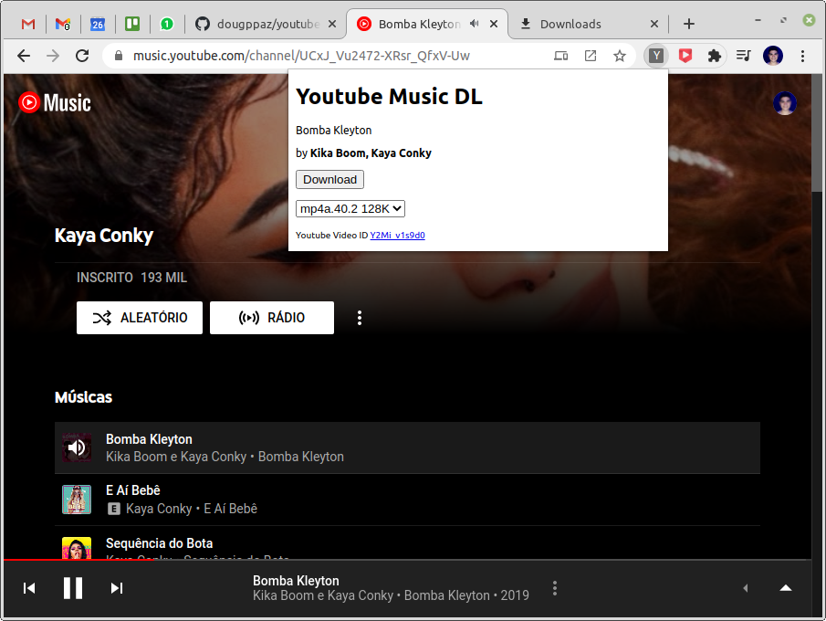

# Youtube Music DL

Youtube Music Downloader. Chrome Extension to download music file with tags and cover from [Youtube Music](https://music.youtube.com).

# Usage

## Download and Install Chrome Extension

1. Download latest release [here](https://github.com/dougppaz/youtube-music-dl/releases/latest/download/youtube-music-dl.zip).
1. Extract files to directory of your taste.
1. Visit `chrome://extensions` (via omnibox or menu -> Tools -> Extensions).
1. Enable Developer mode by ticking the checkbox in the upper-right corner.
1. Click on the "Load unpacked extension..." button.
1. Select the directory containing extracted files.

## Use Youtube Music DL Extension

### Play a music in [Youtube Music](https://music.youtube.com)

### Open Youtube Music DL Extension popup, choose a format and click on Download button.

### Done

