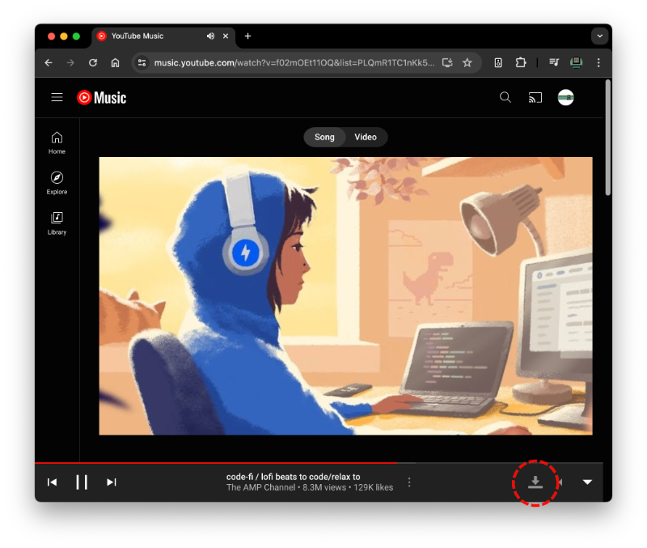

# YouTube Music DL

 

YouTube Music Downloader. Chrome Extension to download music file with tags and cover from [YouTube Music](https://music.YouTube.com).

## Download & Install Chrome Extension

1. Download latest release [here](https://github.com/dougppaz/youtube-music-dl/releases/latest/download/youtube-music-dl.zip).
1. Extract files to directory of your taste.
1. Visit `chrome://extensions` (via omnibox or menu -> Tools -> Extensions).
1. Enable Developer mode by ticking the checkbox in the upper-right corner.
1. Click on the "Load unpacked extension..." button.
1. Select the directory containing extracted files.

## Use YouTube Music DL Extension

### Play a music in [YouTube Music](https://music.youtube.com/)

### Click on Download button

#### or open YouTube Music DL Extension popup, to choose a format

### Done

## Thanks to

- Icons made by [Pixel perfect](https://www.flaticon.com/authors/pixel-perfect) from [www.flaticon.com](https://www.flaticon.com/)
