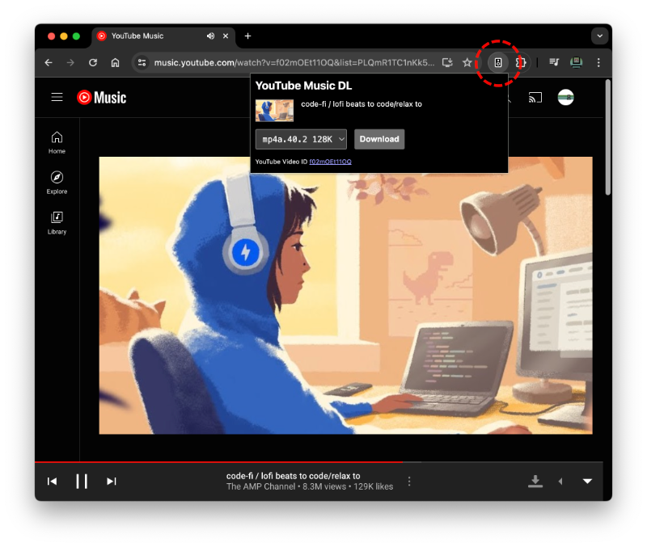
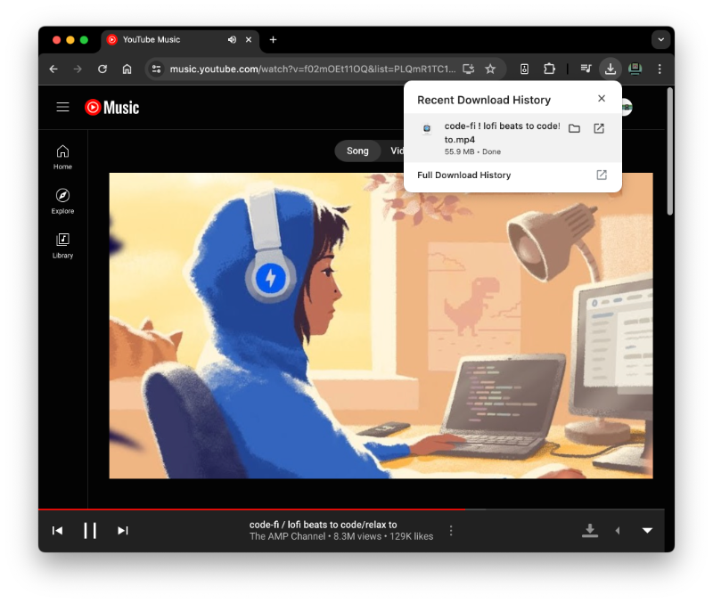

# YouTube Music DL

YouTube Music Downloader. Chrome Extension to download music file with tags and cover from [YouTube Music](https://music.youtube.com/).

## Download & Install Chrome Extension

1. Download latest release `.zip` file in the Releases section [here](./releases/latest/)
1. Extract files to directory of your choice
1. Visit `chrome://extensions` (via omnibox or menu -> Window -> Extensions) in your Chromium based browser
1. Enable Developer mode by ticking the toggle in the upper-right corner
1. Click on the "Load unpacked ..." button
1. Select the directory containing extracted files from this project

## Use YouTube Music DL Extension

### Play a music in [YouTube Music](https://music.youtube.com/)

### Click on Download button

#### or open YouTube Music DL Extension popup, to choose a format

### Done

## Thanks to

- Extension Icon from [css.gg](https://css.gg/music-speaker)
- Download Icon made by [Pixel perfect](https://www.flaticon.com/authors/pixel-perfect) from [www.flaticon.com](https://www.flaticon.com/)
